# About D3D and OpenGL Major matrix

D3D 使用的矩陣運算是 row matrix
			
    [x y z w] * Matrix[4x4]

OpenGL 使用的矩陣運算是 column matrix

    			  [ x ]
    Matrix[4x4] * [ y ]
    			  [ z ]
    			  [ w ]

參考資料

- [關於 OpenGL 和 D3D 的 major matrix](http://blog.cxxl3d.tk/2013/05/opengl-d3d-major-matrix.html?showComment=1444214449193#c7421675933099775191)
- [Matrix Layouts, DirectX and OpenGL](http://www.mindcontrol.org/~hplus/graphics/matrix-layout.html)

看到這裡會覺得 有什麼差別?

疑問1: [ x y z w ] 組成一個向量點，當一個點的時候，w =1 ，如果是方向 w = 0 。

[Homogeneous Coordinate](http://www.songho.ca/math/homogeneous/homogeneous.html)

疑問2: 這導致 許多運算用的矩陣放置的位置不一樣!! 

比方說使用 OpenGL ，由於Vector是最後乘上去的 ，越靠近向量點的運算會先處理。

像典型的乘法順序必須依照  scale, rotation 最後 translation。
但是程式碼必須寫成

    glRotatef(90, 0, 1, 0); // Notice how this is the first operation ...
    // ... but will be applied after
    glScalef(1, 10, 1); // This will be applied first, but is the last operation
    // Zany, right?

另外轉置矩陣可用於 D3D 跟 OpenGL 的執行順序

參考資料
[Opengl order of matrix transformations](http://stackoverflow.com/questions/15993339/opengl-order-of-matrix-transformations/15995026#15995026)

D3D 使用 row-major 的方式儲存矩陣,配合 row matrix 矩陣運算
    
    			[ m0  m1  m2  m3  ]
    [x y z w] * [ m4  m5  m6  m7  ]  = [x' y' z' w']
    			[ m8  m9  m10 m11 ]
    			[ m12 m13 m14 m15 ]
    
    x' = x*m0 + y*m4 + z*m8  + w*m12
    y' = x*m1 + y*m5 + z*m9  + w*m13
    z' = x*m2 + y*m6 + z*m10 + w*m14
    w' = x*m3 + y*m7 + z*m11 + w*m15
    
OpenGL 使用 column-major 的方式儲存矩陣,配合 column matrix 矩陣運算
    
    [ m0  m4  m8  m12 ]	  [ x ]   [ x']
    [ m1  m5  m9  m13 ] * [ y ] = [ y']
    [ m2  m6  m10 m14 ]	  [ z ]   [ z']
    [ m3  m7  m11 m15 ]	  [ w ]   [ w']
    
    x' = x*m0 + y*m4 + z*m8  + w*m12
    y' = x*m1 + y*m5 + z*m9  + w*m13
    z' = x*m2 + y*m6 + z*m10 + w*m14
    w' = x*m3 + y*m7 + z*m11 + w*m15
    
**仔細看運算方式是一模一樣!!**

**但差別在哪裡呢? 矩陣「看」起來會有所不同，但是運算都一樣! **

參考資料

- [OpenGL基本矩陣運算](http://www3.ntu.edu.sg/home/ehchua/programming/opengl/cg_basicstheory.html)
- [D3D基本矩陣運算](https://msdn.microsoft.com/zh-tw/library/windows/desktop/bb206269%28v=vs.85%29.aspx)

----------

# 矩陣運算 #

c = cos 

s = sin 

|vertor[x y z]| = vertor's length.

normalize will make vector length equals 1.

cross = cross product

    cross(left, right)
    L = left, R = right

    left x right =   |  X  Y  Z |
                     | Lx Ly Lz |
                     | Rx Ry Rz |
                 
                 =   | Ly Lz |    | Lz Lx |    | Lx Ly |
                     | Ry Rz |X + | Rz Rx |Y + | Rx Ry |Z
    
                 =   (Ly*Rz - Ry*Lz)X + (Lz*Rx - Rz*Lx)Y + (Lx*Ry - Rx*Ly)Z 
    
	Vector.x = Ly*Rz - Ry*Lz
	Vector.y = Lz*Rx - Rz*Lx
	Vector.z = Lx*Ry - Rx*Ly

	cross(left, right) = -cross(right, left)

dot = dot product

	dot(left, right)

    L = left, R = right

	result = Lx*Rx + Ly*Ry + Lz*Rz

##D3D##

###D3D Scale

				[ Sx  0  0 0 ]
	[x y z w] * [  0 Sy  0 0 ]
				[  0  0 Sz 0 ]
				[  0  0  0 1 ] 

----------
###D3D Rotation X-axis

角度為正值，順時針旋轉;角度為負值，逆時針旋轉。 而座標系上以 **上** 跟 **右** 延伸為正值。

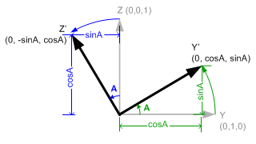

    			[ 1  0  0 0 ]
    [x y z w] * [ 0  c  s 0 ]
    			[ 0 -s  c 0 ]
    			[ 0  0  0 1 ]

假設點為(0,1,0)旋轉A角度則

    			[ 1  0  0 0 ]
    [0 1 0 w] * [ 0  c  s 0 ] = [0 c s w]
    			[ 0 -s  c 0 ]
    			[ 0  0  0 1 ]

假設點為(0,0,1)旋轉A角度則

    			[ 1  0  0 0 ]
    [0 0 1 w] * [ 0  c  s 0 ] = [0 -s c w]
    			[ 0 -s  c 0 ]
    			[ 0  0  0 1 ]

觀察結果 這點的變化是 row 的方向插入。

----------
###D3D Rotation Y-axis

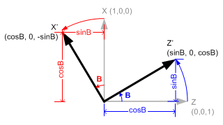

    			[ c  0 -s 0 ]
    [x y z w] * [ 0  1  0 0 ]
    			[ s  0  c 0 ]
    			[ 0  0  0 1 ]

----------

###D3D Rotation Z-axis

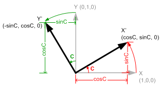

    			[ c  s  0 0 ]
    [x y z w] * [-s  c  0 0 ]
    			[ 0  0  1 0 ]
    			[ 0  0  0 1 ]

----------

###D3D Translation Matrix
    
                [ 1	 0  0 0]
    [x y z w] * [ 0	 1  0 0]
                [ 0	 0  1 0]
                [Tx Ty Tz 1]

----------

###D3D LookAtLH Matrix ( Left-handed ) *
[D3DXMatrixLookAtLH function](https://msdn.microsoft.com/en-us/library/windows/desktop/bb205342%28v=vs.85%29.aspx)

左手中指Z+指向出去，因此自己的眼睛(eye)為負值，因此 Zaxis = normalize(target - eye)。 

拇指指向+Z，四指呈現逆時鐘方向。

Up x Zaxis = Xaxis

Zaxis x  Xaxis = Yaxis
    
    Define: Up = normalize( Up[x y z] )
    
    Zaxis = normalize(target[x y z] - eye[x y z])
    Xaxis = normalize(cross(Up, Zaxis))
    Yaxis = normalize(cross(Zaxis, Xaxis))
    
    [      1      0      0  0 ]   [ Xaxis.x  Yaxis.x  Zaxis.x  0 ]
    [      0      1      0  0 ] * [ Xaxis.y  Yaxis.y  Zaxis.y  0 ]
    [      0      0      1  0 ]   [ Xaxis.z  Yaxis.z  Zaxis.z  0 ]
    [ -eye.x -eye.y -eye.z  1 ]   [       0        0        0  1 ]

      [         Xaxis.x          Yaxis.x         Zaxis.x  0 ]
    = [         Xaxis.y          Yaxis.y         Zaxis.y  0 ]
      [         Xaxis.z          Yaxis.z         Zaxis.z  0 ]
      [ -dot(Xaxis,eye)  -dot(Yaxis,eye) -dot(Zaxis,eye)  1 ]

----------

###D3D LookAtRH Matrix ( Right-handed )
[D3DXMatrixLookAtRH function](https://msdn.microsoft.com/en-us/library/windows/desktop/bb205343%28v=vs.85%29.aspx)

右手中指Z+指向自己的眼睛，因此自己的眼睛(eye)為正值，因此 Zaxis = normalize(eye-target)。 

拇指指向+Z，四指呈現逆時鐘方向。

Up x Zaxis = Xaxis

Zaxis x  Xaxis = Yaxis

    Define: Up = normalize( Up[x y z] )
    
    Zaxis = normalize(eye[x y z] - target[x y z])
    Xaxis = normalize(cross(Up, Zaxis))
    Yaxis = normalize(cross(Zaxis, Xaxis))
    
    [      1      0      0  0 ]   [ Xaxis.x  Yaxis.x  Zaxis.x  0 ]
    [      0      1      0  0 ] * [ Xaxis.y  Yaxis.y  Zaxis.y  0 ]
    [      0      0      1  0 ]   [ Xaxis.z  Yaxis.z  Zaxis.z  0 ]
    [  eye.x  eye.y  eye.z  1 ]   [       0        0        0  1 ]

      [         Xaxis.x          Yaxis.x         Zaxis.x  0 ]
    = [         Xaxis.y          Yaxis.y         Zaxis.y  0 ]
      [         Xaxis.z          Yaxis.z         Zaxis.z  0 ]
      [  dot(Xaxis,eye)   dot(Yaxis,eye)   dot(Zaxis,eye)  1 ]

----------

###D3D Projection 

- l=left
- r=right
- t=top
- b=bottom
- n=nerf
- f=far
- e=eye
- c=clip
- p=projection
- n=Normalized Divice Coordinates

####D3D Perspective Projection (Left-handed, CVV z=[0,1]) 
[D3DXMatrixPerspectiveOffCenterLH function](https://msdn.microsoft.com/en-us/library/windows/desktop/bb205353%28v=vs.85%29.aspx)

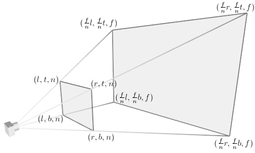

**Perspective Projection** 

**Perspective Projection and Normalized Device Coordinates (NDC)**

上圖右邊為 Normalized Device Coordinates，此方塊為 Canonical View Volume(CVV)，與OpenGL不同是z的範圍，OpenGL是定義為[-1,1]，D3D是[0,1]

 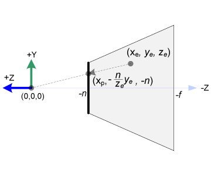

上圖左邊是從上面觀察的剖面圖，右邊是從側邊. D3D使用左手+z為看出去的方向。

E點為Eye Coordinates上的一點 E(Xe,Ye,Ze)，而Project在nerf上的P點為P(Xp,Yp,Zp)

P因為投射n平面上(使得z為n)，因此 Zp=n, 同時P點也是最後呈現在螢幕上的點，也就是位於Normalized Device Coordinates(NDC)的Canonical View Volume(CVV)範圍中。

根據相似三角形得到以下結果

- Xp= n/Ze*Xe
- Yp= n/Ze*Ye
- Zp= n

P(Xp, Yp, Zp) = P(n/Ze*Xe, n/Ze*Ye, n)

E(Xe, Ye, Ze) → [Projection Matrix] → C(Xc, Yc, Zc) → [Divide by W] → P(Xp, Yp, Zp)

**P點跟N點都是同屬一個點**,P點是根據我們目測投射出來的結果，投射在nerf平面上的一個點。而N點是對應到根據矩陣運算位於Normailize Device Coordinates。 而兩點間的對應關係，可以用**直線方程式**來定義 y=mx+b

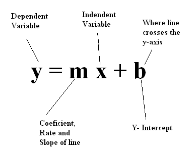

E點multiply[Projection Matrix]變成C點。

C(Xc, Yc, Zc) 為 Clip Coordinates 中的一點，也就是整個Frustum的錐形空間。

最後C點除以自己的W變成Normail Device Coordinates(NDC)，定義為N點。

N(Xn, Yn, Zn) = (Xc/Wc, Yc/Wc, Zc/Wc)

用矩陣表示如下

    										[  					]
    [Xc, Yc, Zc, Wc] = [Xe, Ye, Ze, We]	 x	[ Projection Matrix	]
    										[					]
    										[					]

	[Xn, Yn, Zn] =	[Xc/Wc, Yc/Wc, Zc/Wc]

觀察P點的組成，配合除以W變成N點，Xc跟Yc都除以Ze, 我們令 Wc=Ze，讓他戴上負號離開，可使得運式更簡單。

    										[.	.	.	0]
    [Xc, Yc, Zc, Wc] = [Xe, Ye, Ze, We]	 x	[.	.	.	0]
    										[.	.	.	1]
    										[.	.	.	0]

處理P點跟N點的關係,Xp的範圍為[l,r], Xn的範圍為[-1,1]。

----------

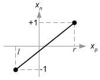

1. When Xn=1, Xp=r  
2. When Xn=-1, Xp=l
3. Xn=(1-(-1))/(r-l)*Xp + b  (根據直線公式)
4. b= (l+r)/(l-r)
5. Xn=2/(r-l)*Xp+(l+r)/(l-r)  
6. Xn=( 2n/(r-l)*Xe + (l+r)/(l-r)*Ze )/Ze
7. Xn=Xc/Wc,Wc=Ze, 所以 Xc=2n/(r-l)*Xe + (l+r)/(l-r)*Ze 

將 1. 帶入 3. 得到 4.
1 = 1-(-1)/(r-l)*r + b

    b=1-2r/(r-l)
     =(-r-l)/(r-l)
     =-(r+l)/(r-l)
	 =(l+r)/(l-r)

將 4. 帶回到 1. 得到 5.
		
將 Xp= n/Ze*Xe 帶入 5. 得到 6.

    										[2n/(r-l)		.	.	0]
    [Xc, Yc, Zc, Wc] = [Xe, Ye, Ze, We]	 x	[0				.	.	0]
    										[(l+r)/(l-r)	.	.	1]
    										[0				.	.	0]

----------

同理Yp=[b,t], Yn=[-1,1]

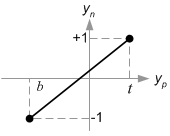

1. When Yn=1, Yp=t
2. When Yn=-1, Yp=b
3. Yn=(1-(-1))/(t-b)*Yp + b  (根據直線公式)
4. b= (b+t)/(b-t)
5. Yn=2/(t-b)*Yp+(b+t)/(b-t)  
6. Yn=( 2n/(t-b)*Ye + (b+t)/(b-t)*Ze )/Ze
7. Yn=Yc/Wc,Wc=Ze, 所以 Yc=2n/(t-b)*Ye + (b+t)/(b-t)*Ze

將 1. 帶入 3. 得到 4.
1 = 1-(-1)/(t-b)*t + b

    b=1-2t/(t-b)
     =(-t-b)/(t-b)
     =-(b+t)/(t-b)
	 =(b+t)/(b-t)

將 4. 帶回到 1. 得到 5.
		
將 Xp= n/Ze*Xe 帶入 5. 得到 6.

    										[2n/(r-l)		0			.	0]
    [Xc, Yc, Zc, Wc] = [Xe, Ye, Ze, We]	 x	[0				2n/(t-b)	.	0]
    										[(l+r)/(l-r)	(b+t)/(b-t)	.	1]
    										[0				0			.	0]

----------

求 Zc ，我們已知Zc不會被 Xe 跟 Ye所影響，然後我們設剩下的兩個為代數A,B , 然後E點是一個點，所以We=1

    										[2n/(r-l)		0			0	0]
    [Xc, Yc, Zc, Wc] = [Xe, Ye, Ze, We]	 x	[0				2n/(t-b)	0	0]
    										[(l+r)/(l-r)	(b+t)/(b-t)	A	1]
    										[0				0			B	0]

Zc=A*Ze+B

Zn=Zc/Wc=(A*Ze+B)/Ze

Zn範圍[0,1], Ze範圍[n,f]

1. When Zn=0, Ze=n
2. When Zn=1, Ze=f
3. 0=(An+B)/n
4. 0=An+B
5. 1=(Af+B)/f
6. f=Af+B
7. A=f/(f-n)
8. B=-(2fn)/(f-n)

將6.減去4.得到7.

f=Af-An=A(f-n)

A=f/(f-n)

將7.帶入4.得到8.

0=f/(f-n)*n+B

0=-nf/(n-f)+B

B=nf/(n-f)

    										[2n/(r-l)		0				0			0]
    [Xc, Yc, Zc, Wc] = [Xe, Ye, Ze, We]	 x	[0				2n/(t-b)		0			0]
    										[(l+r)/(l-r)	(b+t)/(b-t)		f/(f-n)		1]
    										[0				0				nf/(n-f)	0]

### D3D Orthographic Projection (Left-handed, CVV z=[0,1]) 

[D3DXMatrixOrthoOffCenterLH function](https://msdn.microsoft.com/en-us/library/windows/desktop/bb205347%28v=vs.85%29.aspx)

E(Xe, Ye, Ze) → [Projection Matrix] → N(Xn, Yn, Zn)

    										[  					]
    [Xn, Yn, Zn, Wn] = [Xe, Ye, Ze, We]	 x	[ Projection Matrix	]
    										[					]
    										[					]

E點映射為N點，由於直接映射所以得到

Xn=Xe
Yn=Ye
Ze=n

----------

Xn範圍[-1,1]對應Xe範圍[l,r]

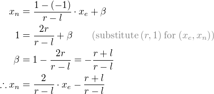

1. When Xn=1, Xe=r  
2. When Xn=-1, Xe=l
3. Xn=(1-(-1))/(r-l)*Xe + b  (根據直線公式)
4. b= (l+r)/(l-r)
5. Xn=2/(r-l)*Xe+(l+r)/(l-r) 

將1.帶入3.得到4.

1=2r/(r-l)+b

b=1-2r/(r-l)
 =(-r-l)/(r-l)
 =-(l+r)/(r-l)
 =(l+r)/(l-r)

    										[2/(r-l) 		.	.	.]
    [Xn, Yn, Zn, Wn] = [Xe, Ye, Ze, We]	 x	[0				.	.	.]
    										[0				.	.	.]
    										[(l+r)/(l-r)	.	.	.]

----------

Yn範圍[-1,1]對應Ye範圍[b,t]

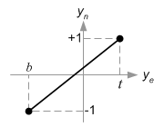

1. When Yn=1, Ye=t  
2. When Yn=-1, Ye=b
3. Yn=(1-(-1))/(t-b)*Ye + b  (根據直線公式)
4. b= (b+t)/(b-t)
5. Yn=2/(t-b)*Ye+(b+t)/(b-t)

將1.帶入3.得到4.

1=2t/(t-b)+b

b=1-2t/(t-b)
 =(-t-b)/(t-b)
 =-(b+t)/(t-b)
 =(b+t)/(b-t)

    										[2/(r-l) 		0				.	.]
    [Xn, Yn, Zn, Wn] = [Xe, Ye, Ze, We]	 x	[0				2/(t-b)			.	.]
    										[0				0				.	.]
    										[(l+r)/(l-r)	(b+t)/(b-t)		.	.]

----------

Zn範圍[0,1]對應Ze範圍[n,f]

1. When Zn=1, Ze=f  
2. When Zn=0, Ze=n
3. Zn=(1-0)/(f-n)*Ze + b  (根據直線公式)
4. b= -(f+n)/(f-n)
5. Zn=1/(f-n)*Ze + n/(n-f)

將1.帶入3.得到4.

1=f/(f-n)+b

b=1-f/(f-n)
 =((f+n)-f)/(f+n)
 =n/(n-f)

    										[2/(r-l) 		0				0		.]
    [Xn, Yn, Zn, Wn] = [Xe, Ye, Ze, We]	 x	[0				2/(t-b)			0		.]
    										[0				0				1/(f-n)	.]
    										[(l+r)/(l-r)	(b+t)/(b-t)		n/(n-f)	.]

E點跟N點的W皆為1，代表一個點。

    										[2/(r-l) 		0				0			0]
    [Xn, Yn, Zn, Wn] = [Xe, Ye, Ze, We]	 x	[0				2/(t-b)			0			0]
    										[0				0				1/(f-n)		0]
    										[(l+r)/(l-r)	(b+t)/(b-t)		n/(n-f)		1]

###D3D Viewport

[Viewports and Clipping](https://msdn.microsoft.com/en-us/library/windows/desktop/bb206341%28v=vs.85%29.aspx)

[Viewport](https://msdn.microsoft.com/zh-tw/library/microsoft.windowsmobile.directx.direct3d.viewport%28v=vs.85%29.aspx)

Z=[0,1]

    										[w/2 		0				0			0]
    [Xw, Yw, Zw, Ww] = [Xn, Yn, Zn, Wn]	 x	[0			-h/2			0			0]
    										[0			0				maxZ-minZ	0]
    										[w/2+x		h/2+y			minZ		1]

    										
    [Xw, Yw, Zw, Ww] = [w/2*Xn + w/2 + x, -h/2*Yn + h/2 + y, (maxZ-minZ)Zn + minZ, Wn]	
    										
    										
原始碼

    										[w			0				0			0]
    [Xw, Yw, Zw, Ww] = [Xn, Yn, Zn, Wn]	 x	[0			-h				0			0]
    										[0			0				maxZ-minZ	0]
    										[w/2+x		h/2+y			minZ		1]

    										
    [Xw, Yw] = [w/2*Xn + w/2 + x, -h/2*Yn + h/2 + y]	
##OpenGL

###OpenGL Scale

	[ Sx  0  0 0 ]   [ x ]
	[  0 Sy  0 0 ] * [ y ]
	[  0  0 Sz 0 ]   [ z ]
	[  0  0  0 1 ]   [ w ]

----------

###OpenGL Rotation X-axis

角度為正值，順時針旋轉;角度為負值，逆時針旋轉。 而座標系上以 **上** 跟 **右** 延伸為正值。

    [ 1  0  0 0 ]	[ x ]
    [ 0  c -s 0 ] * [ y ]
    [ 0  s  c 0 ]	[ z ]
    [ 0  0  0 1 ]	[ w ]

假設點為(0,1,0)旋轉A角度則

    [ 1  0  0 0 ]	[ 0 ]	[ 0 ]
    [ 0  c -s 0 ] * [ 1 ] =	[ c ]
    [ 0  s  c 0 ]	[ 0 ]	[ s ]
    [ 0  0  0 1 ]	[ w ]	[ w ]

假設點為(0,0,1)旋轉A角度則

    [ 1  0  0 0 ]	[ 0 ]	[ 0 ]
    [ 0  c -s 0 ] * [ 0 ] =	[-s ]
    [ 0  s  c 0 ]	[ 1 ]	[ c ]
    [ 0  0  0 1 ]	[ w ]	[ w ]

觀察結果 這點的變化是 column 的方向插入。

----------

###OpenGL Rotation Y-axis

    [ c  0  s 0 ]	[ x ]
    [ 0  1  0 0 ] * [ y ]
    [-s  0  c 0 ]	[ z ]
    [ 0  0  0 1 ]	[ w ]

----------

###OpenGL Rotation Z-axis

    [ c -s  0 0 ]	[ x ]
    [ s  c  0 0 ] *	[ y ]
    [ 0  0  1 0 ]	[ z ]
    [ 0  0  0 1 ]	[ w ]

----------

###OpenGL Translation Matrix
    
    [ 1	0 0 Tx ]   [ x ]
    [ 0	1 0 Ty ] * [ y ]
    [ 0	0 1 Tz ]   [ z ]
    [ 0 0 0 1  ]   [ w ]

----------

###OpenGL LookAtLH Matrix ( Left-handed )
**# OpenGL 不提供 Left-handed**

左手中指Z+指向出去，因此自己的眼睛(eye)為負值，因此 Zaxis = normalize(target - eye)。 

拇指指向+Z，四指呈現逆時鐘方向。

Up x Zaxis = Xaxis

Zaxis x  Xaxis = Yaxis

    Define: Up = normalize( Up[x y z] )
    
    Zaxis = normalize(target[x y z] - eye[x y z])
    Xaxis = normalize(cross(Up, Zaxis))
    Yaxis = normalize(cross(Zaxis, Xaxis))

    [ Xaxis.x  Xaxis.y  Xaxis.z  0 ]   [      1       0       0   -eye.x ]
    [ Yaxis.x  Yaxis.y  Yaxis.z  0 ] * [      0       1       0   -eye.y ]
    [ Zaxis.x  Zaxis.y  Zaxis.z  0 ]   [      0       0       1   -eye.z ]
    [       0        0        0  1 ]   [      0       0       0        1 ]

      [  Xaxis.x  Xaxis.y  Xaxis.z  -dot(Xaxis, eye) ]
    = [  Yaxis.x  Yaxis.y  Yaxis.z  -dot(Yaxis, eye) ]
      [  Zaxis.x  Zaxis.y  Zaxis.z  -dot(Zaxis, eye) ]
      [        0        0        0                 1 ]

----------

###OpenGL LookAtRH Matrix ( Right-handed ) *
[gluLookAt](http://people.freedesktop.org/~idr/glu3/glu3_8h.html)

[OpenGL Lookat to Axes](http://www.songho.ca/opengl/gl_lookattoaxes.html)

[OpenGL Angles to Axes](http://www.songho.ca/opengl/gl_anglestoaxes.html)

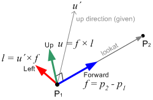

P2是target, P1是eye的位置, u' 是給定的方向，通常Up(0,1,0)

右手中指Z+指向自己的眼睛，因此自己的眼睛(eye)為正值，因此 Zaxis = normalize(eye-target)。 

拇指指向+Z，四指呈現逆時鐘方向。

Up x Zaxis = Xaxis

Zaxis x  Xaxis = Yaxis

    Define: Up = normalize( Up[x y z] )
    
    Zaxis = normalize(eye[x y z]- target[x y z])
    Xaxis = normalize(cross(Up, Zaxis))
    Yaxis = normalize(cross(Zaxis, Xaxis))

    [ Xaxis.x  Xaxis.y  Xaxis.z  0 ]   [      1       0       0    eye.x ]
    [ Yaxis.x  Yaxis.y  Yaxis.z  0 ] * [      0       1       0    eye.y ]
    [ Zaxis.x  Zaxis.y  Zaxis.z  0 ]   [      0       0       1    eye.z ]
    [       0        0        0  1 ]   [      0       0       0        1 ]

      [  Xaxis.x  Xaxis.y  Xaxis.z  dot( Xaxis, eye) ]
    = [  Yaxis.x  Yaxis.y  Yaxis.z  dot( Yaxis, eye) ]
      [  Zaxis.x  Zaxis.y  Zaxis.z  dot( Zaxis, eye) ]
      [        0        0        0                 1 ]

----------
###OpenGL Projection 

- l=left
- r=right
- t=top
- b=bottom
- n=nerf
- f=far
- e=eye
- c=clip
- p=projection
- n=Normalized Divice Coordinates

####OpenGL Perspective Projection (Right-handed, CVV z=[-1,1]) 
[OpenGL Projection Matrix](http://www.songho.ca/opengl/gl_projectionmatrix.html)

**Perspective Projection** 從上圖發現存一個 f/n 的線性關係

**Perspective Projection and Normalized Device Coordinates (NDC)**

上圖右邊為 Normalized Device Coordinates，此方塊為 Canonical View Volume(CVV)，與D3D不同是z的範圍，OpenGL是定義為[-1,1]，D3D是[0,1]

 

上圖左邊是從上面觀察的剖面圖，右邊是從側邊，我們從中發現 n 跟 f 都是負值!，因為OpenGL使用右手+z指向自己，看出去的-z方向為負值。

E點為Eye Coordinates上的一點 E(Xe,Ye,Ze)，而Project在nerf上的P點為P(Xp,Yp,Zp)

P因為投射-n平面上(使得z為-n)，因此 Zp=-n, 同時P點也是最後呈現在螢幕上的點，也就是位於Normalized Device Coordinates(NDC)的Canonical View Volume(CVV)範圍中。

根據相似三角形得到以下結果

- Xp= -n/Ze*Xe
- Yp= -n/Ze*Ye
- Zp= -n
P(Xp, Yp, Zp) = P(-n/Ze*Xe, -n/Ze*Ye, -n)

根據以上判斷

E(Xe, Ye, Ze) → Project → P(Xp, Yp, Zp)

E(Xe, Ye, Ze) → [Projection Matrix] → C(Xc, Yc, Zc) → [Divide by W] → N(Xn, Yn, Zn)

**P點跟N點都是同屬一個點**,P點是根據我們目測投射出來的結果，投射在nerf平面上的一個點。而N點是對應到根據矩陣運算位於Normailize Device Coordinates。 而兩點間的對應關係，可以用**直線方程式**來定義 y=mx+b

E點multiply[Projection Matrix]變成C點。

C(Xc, Yc, Zc) 為 Clip Coordinates 中的一點，也就是整個Frustum的錐形空間。

最後C點除以自己的W變成Normail Device Coordinates(NDC)，定義為N點。

N(Xn, Yn, Zn) = (Xc/Wc, Yc/Wc, Zc/Wc)

用矩陣表示如下

    [Xc]	[					]	[ Xe ]
    [Yc] =	[ Projection Matrix	] x	[ Ye ]
    [Zc]	[					]	[ Ze ]
    [Wc]	[					]	[ We ]
    
	[Xn]	[Xc/Wc]
	[Yn] =	[Yc/Wc]
	[Zn]	[Zc/Wc]

觀察P點的組成，配合除以W變成N點，Xc跟Yc都除以Ze, 我們令 Wc=-Ze，讓他戴上負號離開，可使得運式更簡單。

    [Xc]	[.	.	.	.	]	[ Xe ]
    [Yc] =	[.	.	.	.	] x	[ Ye ]
    [Zc]	[.	.	.	.	]	[ Ze ]
    [Wc]	[0	0	-1	0	]	[ We ]

處理P點跟N點的關係,Xp的範圍為[l,r], Xn的範圍為[-1,1]。

----------

1. When Xn=1, Xp=r  
2. When Xn=-1, Xp=l
3. Xn=(1-(-1))/(r-l)*Xp + b  (根據直線公式)
4. b= -(r+l)/(r-l)
5. Xn=2/(r-l)*Xp-(r+l)/(r-l)  
6. Xn=( 2n/(r-l)*Xe + (r+l)/(r-l)*Ze )/-Ze
7. Xn=Xc/Wc,Wc=-Ze, 所以 Xc=2n/(r-l)*Xe + (r+l)/(r-l)*Ze 

將 1. 帶入 3. 得到 4.
1 = 1-(-1)/(r-l)*r + b

    b=1-2r/(r-l)
     =(-r-l)/(r-l)
     =-(r+l)/(r-l)

將 4. 帶回到 1. 得到 5.
		
將 Xp= -n/Ze*Xe 帶入 5. 得到 6.

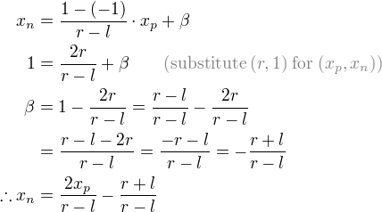

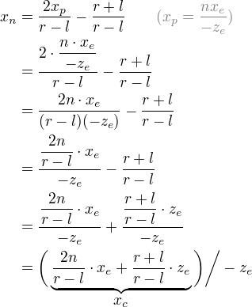

    [Xc]	[2n/(r-l)	0	(r+l)/(r-l)	0	]	[ Xe ]
    [Yc] =	[.			.	.			.	] x	[ Ye ]
    [Zc]	[.			.	.			.	]	[ Ze ]
    [Wc]	[0			0	-1			0	]	[ We ]

----------

同理Yp=[b,t], Yn=[-1,1]

1. When Yn=1, Yp=t
2. When Yn=-1, Yp=b
3. Yn=(1-(-1))/(t-b)*Yp + b  (根據直線公式)
4. b= -(t+b)/(t-b)
5. Yn=2/(t-b)*Yp-(t+b)/(t-b)  
6. Yn=( 2n/(t-b)*Ye + (t+b)/(t-b)*Ze )/-Ze
7. Yn=Yc/Wc,Wc=-Ze, 所以 Yc=2n/(t-b)*Ye + (t+b)/(t-b)*Ze
 
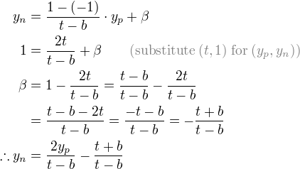

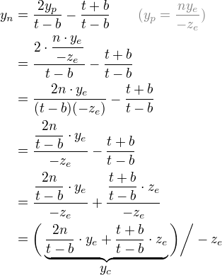

    [Xc]	[2n/(r-l)	0			(r+l)/(r-l)		0	]	[ Xe ]
    [Yc] =	[0			2n/(t-b)	(t+b)/(t-b)		0	] x	[ Ye ]
    [Zc]	[.			.			.				.	]	[ Ze ]
    [Wc]	[0			0			-1				0	]	[ We ]

----------

求 Zc ，我們已知Zc不會被 Xe 跟 Ye所影響，然後我們設剩下的兩個為代數A,B , 然後E點是一個點，所以We=1

    [Xc]	[2n/(r-l)	0			(r+l)/(r-l)		0	]	[ Xe ]
    [Yc] =	[0			2n/(t-b)	(t+b)/(t-b)		0	] x	[ Ye ]
    [Zc]	[0			0			A				B	]	[ Ze ]
    [Wc]	[0			0			-1				0	]	[ We ]

Zc=A*Ze+B

Zn=Zc/Wc=(A*Ze+B)/-Ze

Zn範圍[-1,1], Ze範圍[-n,-f]

1. When Zn=-1, Ze=-n
2. When Zn=1, Ze=-f
3. -1=(A*(-n)+B)/(-(-n))
4. -n=(A*(-n)+B), -n=-An+B
5. 1=(A*(-f)+B)/(-(-f))
6. f=(A*(-f)+B)=-Af+B
7. A=-(f+n)/(f-n)
8. B=-(2fn)/(f-n)

將6.減去4.得到7.

(f+n)=-Af+An=A(-f+n)

A=-(f+n)/(f-n)

將7.帶入4.得到8.

-n=-(f+n)/(f-n)*(-n)+B

-n=(f+n)/(f-n)*n+B

B=-n*(1+(f+n)/(f-n))=-n(2f/(f-n))=-2fn/(f-n)

    [Xc]	[2n/(r-l)	0			(r+l)/(r-l)		0			]	[ Xe ]
    [Yc] =	[0			2n/(t-b)	(t+b)/(t-b)		0			] x	[ Ye ]
    [Zc]	[0			0			-(f+n)/(f-n)	-(2fn)/(f-n)]	[ Ze ]
    [Wc]	[0			0			-1				0			]	[ We ]

####OpenGL Orthographic Projection (Right-handed, CVV z=[-1,1]) 

E點為Eye Coordinates上的一點 E(Xe,Ye,Ze)，而Project在nerf上的點為N(Xn,Yn,Zn)

根據 Orthographic 直接映射得到以下結果

- Xn= Xe
- Yn= Ye
- Zn= -n

E(Xe, Ye, Ze) → [Projection Matrix] → N(Xn, Yn, Zn)

    [Xn]	[					]	[ Xe ]
    [Yn] =	[ Projection Matrix	] x	[ Ye ]
    [Zn]	[					]	[ Ze ]
    [Wn]	[					]	[ We ]

----------

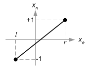

1. When Xn=1, Xe=r  
2. When Xn=-1, Xe=l
3. Xn=(1-(-1))/(r-l)*Xe + b  (根據直線公式)
4. b= -(r+l)/(r-l)
5. Xn=2/(r-l)*Xe-(r+l)/(r-l)  

    [Xn]	[2/(r-l)	0	0	-(r+l)/(r-l)	]	[ Xe ]
    [Yn] =	[.			.	.	.				] x	[ Ye ]
    [Zn]	[.			.	.	.				]	[ Ze ]
    [Wn]	[.			.	.	.				]	[ We ]

----------

1. When Yn=1, Ye=t  
2. When Yn=-1, Ye=b
3. Yn=(1-(-1))/(t-b)*Ye + b  (根據直線公式)
4. b= -(t+b)/(t-b)
5. Yn=2/(t-b)*Ye-(t+b)/(t-b)  

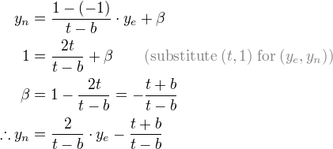

    [Xn]	[2/(r-l)	0		0	-(r+l)/(r-l)	]	[ Xe ]
    [Yn] =	[0			2/(t-b)	0	-(t+b)/(t-b)	] x	[ Ye ]
    [Zn]	[.			.		.	.				]	[ Ze ]
    [Wn]	[.			.		.	.				]	[ We ]

----------

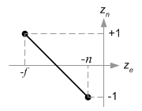

1. When Zn=1, Ze=-f  
2. When Zn=-1, Ze=-n
3. Zn=(1-(-1))/(-f-(-n))*Ze + b  (根據直線公式)
4. b= -(f+n)/(f-n)
5. Zn=-2/(f-n)*Ze-(f+n)/(f-n)  

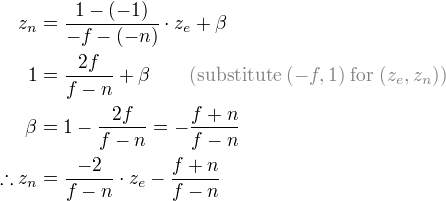

    [Xn]	[2/(r-l)	0		0			-(r+l)/(r-l)	]	[ Xe ]
    [Yn] =	[0			2/(t-b)	0			-(t+b)/(t-b)	] x	[ Ye ]
    [Zn]	[0			0		-2/(f-n)	-(f+n)/(f-n)	]	[ Ze ]
    [Wn]	[.			.		.			.				]	[ We ]

E點跟N點的W皆為1，代表一個點。

    [Xn]	[2/(r-l)	0		0			-(r+l)/(r-l)	]	[ Xe ]
    [Yn] =	[0			2/(t-b)	0			-(t+b)/(t-b)	] x	[ Ye ]
    [Zn]	[0			0		-2/(f-n)	-(f+n)/(f-n)	]	[ Ze ]
    [Wn]	[0			0		0			1				]	[ We ]

###OpenGL Viewport

[OpenGL Transformation](http://www.songho.ca/opengl/gl_transform.html)

[glViewport(x, y, w, h)](http://lmb.informatik.uni-freiburg.de/people/reisert/opengl/doc/glViewport.html)

    [Xw]	[w/2		0		0			w/2 + x	]	[ Xn ]
    [Yw] =	[0		  h/2		0			h/2 + y	] x	[ Yn ]
    [Zw]	[0			0		(f-n)/2		(f+n)/2	]	[ Zn ]
    [Ww]	[0			0		0			1		]	[ Wn ]

    [Xw]	[ (w/2*Xn)		+ (x+w/2)	]
    [Yw] =	[ (h/2*Yn)		+ (y+h/2)	]
    [Zw]	[ (f-n)/2*Zn	+ (f+n)/2	]
    [Ww]	[				1			]

不懂為什麼要除以2

**但是如果寫成程式碼，你會發現根本一模一樣的運算!! 差別在於 D3D使用 Left-handed, OpenGL使用 Right-handed的差別，跟Canonical View Volume的z範圍定義不同，D3D z=[0,1], OpenGL z=[-1,1]**

# Transformation

[OpenGL Transformation](http://www.songho.ca/opengl/gl_transform.html)

    Object Space (Object Coordinates)
    
    	Model Matrix ( multiply Object's  scale, rotation, translation )
    
    World Space (Model Space)
    
    	View Matrix ( multiply Camera LookAt )
    
    Camera Space (Eye Space or View Space or Eye Coordinates)
    
    	Projection Matrix ( multiply Frustum.  ex: Perspective, Ortho)
    
    Clip Coordinates
	
		Divide by w
	
	Nomalized Device Coordinates ( The range of values is now normalized from -1 to 1 in all 3 axes. )
	
		Viewport Transform

	Window Coordinates (Screen Coordinates)

[Coordinate Systems in OpenGL](http://www.matrix44.net/cms/notes/opengl-3d-graphics/coordinate-systems-in-opengl)

Scale * Rotation * Translation

http://gamedev.stackexchange.com/questions/16719/what-is-the-correct-order-to-multiply-scale-rotation-and-translation-matrices-f

Raw
http://www.codinglabs.net/article_world_view_projection_matrix.aspx

canonical view volume (CVV)
http://www.programmershare.com/2606346/
http://stackoverflow.com/questions/14500881/whats-the-different-between-perspectivelh-and-perspectivefieldofviewlh-and-di
http://www.adobe.com/devnet/flashplayer/articles/perspective-projection.html
http://blog.csdn.net/popy007/article/details/1797121
http://blog.csdn.net/popy007/article/details/4091967
http://m.blog.csdn.net/blog/fanbird2008/17846641
https://unspecified.wordpress.com/2012/06/21/calculating-the-gluperspective-matrix-and-other-opengl-matrix-maths/
